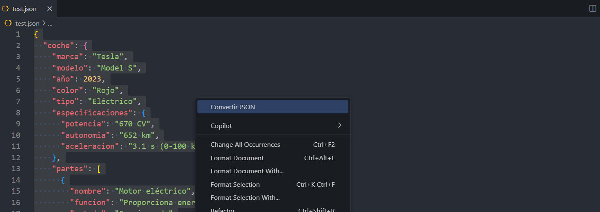

# json2entity VS Code Extension

Convert any selected JSON into Java, Python, or C# model classes directly from your VS Code editor.

## Features

- **Language Support**: Easily generate models in **Java**, **Python**, or **C#**.  
- **Simple Workflow**: Highlight the JSON in your editor, open the command palette, and generate your model.  
- **Automatic Class Name Suggestions**: The extension can suggest class names based on file or selection context.  
- **Customizable Output**: Specify how you want your classes structured—e.g., private fields with getters/setters for Java or property decorators in Python.

## Installation

1. **From VS Code Marketplace** (recommended):  
   - Open Visual Studio Code.  
   - Go to the **Extensions** sidebar (`View > Extensions`).  
   - Search for `json2entity` (or your extension’s name).  
   - Click **Install**.  

2. **From VSIX File**:  
   - Download the `.vsix` file from the [Releases](#) page (or your designated location).  
   - In Visual Studio Code, open the **Extensions** sidebar.  
   - Click the ellipsis (`...`) in the top-right corner and select **Install from VSIX...**.  
   - Browse to the `.vsix` file, select it, and install.

## Usage

1. **Open a JSON file** or paste JSON data into an existing file in VS Code.  
2. **Select** the JSON object (highlight the text you want to convert).  
3. **Command Palette**: Press <kbd>Ctrl + Shift + P</kbd> (Windows/Linux) or <kbd>Cmd + Shift + P</kbd> (macOS) to open the command palette.  
4. Type:  
``` cmd 
convertir json
```
and select it from the list of commands.  
5. **Choose a Language**: A quick pick menu will appear. Select **Java**, **Python**, or **C#**.  
6. **Specify Class Name** (if prompted): Enter the desired class name.  
7. **Generated Code**: The extension will create and open a new file (or insert code in place, depending on your settings) with the generated model.

**Using GUI** 

## Configuration

You can customize the extension to fit your needs by editing your **VS Code Settings** (<kbd>File</kbd> > <kbd>Preferences</kbd> > <kbd>Settings</kbd> on Windows/Linux or <kbd>Code</kbd> > <kbd>Preferences</kbd> > <kbd>Settings</kbd> on macOS). Some potential configuration options might include:

- **json2entity.outputFolder**: Choose the folder where generated model files should be placed.  
- **json2entity.namingConvention**: Select the naming convention for fields/properties (e.g., `snake_case`, `camelCase`, `PascalCase`).  
- **json2entity.overwriteExisting**: If set to `true`, automatically overwrite existing model files with the same name.

*(Adjust or remove this section if these settings are not yet implemented.)*

## Example

```json
{
"id": 123,
"title": "Example Model",
"details": {
 "author": "John Doe",
 "createdDate": "2025-01-26"
}
}
```
# Java
``` java
public class ExampleModel {
    private int id;
    private String title;
    private Details details;

    // getters and setters
}

public class Details {
    private String author;
    private String createdDate;

    // getters and setters
}
```
# Python

``` python
class ExampleModel:
    def __init__(self, id: int, title: str, details: 'Details'):
        self.id = id
        self.title = title
        self.details = details

class Details:
    def __init__(self, author: str, createdDate: str):
        self.author = author
        self.createdDate = createdDate
```
# C#
```c#
public class ExampleModel
{
    public int Id { get; set; }
    public string Title { get; set; }
    public Details Details { get; set; }
}

public class Details
{
    public string Author { get; set; }
    public string CreatedDate { get; set; }
}
```
